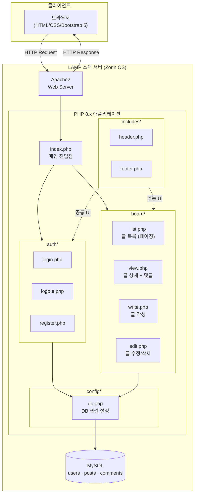
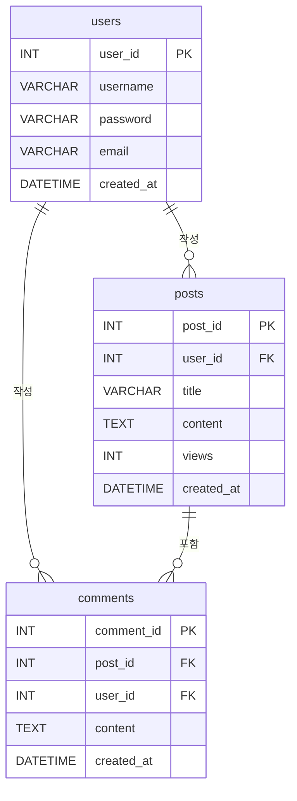

# 게시판 + 로그인 시스템

LAMP 스택을 활용한 회원 로그인 및 게시판 웹 애플리케이션

---

## 시스템 아키텍처



---

## 데이터베이스 ERD



---

## 기술 스택

| 구분 | 기술 |
|------|------|
| OS | Zorin OS (Linux) |
| Web Server | Apache 2.4 |
| Database | MySQL 8.0 |
| Backend | PHP 8.3 |
| Frontend | HTML, CSS, Bootstrap 5 |

---

## 주요 기능

### 회원 관리
- 회원가입 (아이디 / 비밀번호 / 이메일)
- 로그인 / 로그아웃
- 세션 기반 인증
- 비밀번호 암호화 (`password_hash` / `password_verify`)

### 게시판
- 글 목록 조회 (페이징 처리)
- 글 작성 (로그인 필요)
- 글 수정 / 삭제 (본인만 가능)
- 글 상세 보기 + 조회수
- 댓글 기능

---

## 디렉토리 구조

```
board/
├── config/
│   ├── db.php            # DB 연결 설정 (git 제외)
│   └── db.example.php    # DB 설정 예시 파일
├── auth/
│   ├── login.php         # 로그인
│   ├── logout.php        # 로그아웃
│   └── register.php      # 회원가입
├── board/
│   ├── list.php          # 글 목록 (페이징)
│   ├── view.php          # 글 상세 + 댓글
│   ├── write.php         # 글 작성
│   └── edit.php          # 글 수정 / 삭제
├── includes/
│   ├── header.php        # 공통 헤더 (Bootstrap 네비게이션)
│   └── footer.php        # 공통 푸터
└── index.php             # 메인 진입점
```

---

## 데이터베이스 구조

```sql
-- 사용자
CREATE TABLE users (
    user_id    INT AUTO_INCREMENT PRIMARY KEY,
    username   VARCHAR(50)  NOT NULL UNIQUE,
    password   VARCHAR(255) NOT NULL,
    email      VARCHAR(100) NOT NULL UNIQUE,
    created_at DATETIME DEFAULT CURRENT_TIMESTAMP
);

-- 게시글
CREATE TABLE posts (
    post_id    INT AUTO_INCREMENT PRIMARY KEY,
    user_id    INT NOT NULL,
    title      VARCHAR(200) NOT NULL,
    content    TEXT NOT NULL,
    views      INT DEFAULT 0,
    created_at DATETIME DEFAULT CURRENT_TIMESTAMP,
    FOREIGN KEY (user_id) REFERENCES users(user_id) ON DELETE CASCADE
);

-- 댓글
CREATE TABLE comments (
    comment_id INT AUTO_INCREMENT PRIMARY KEY,
    post_id    INT NOT NULL,
    user_id    INT NOT NULL,
    content    TEXT NOT NULL,
    created_at DATETIME DEFAULT CURRENT_TIMESTAMP,
    FOREIGN KEY (post_id) REFERENCES posts(post_id) ON DELETE CASCADE,
    FOREIGN KEY (user_id) REFERENCES users(user_id) ON DELETE CASCADE
);
```

---

## 설치 방법

### 1. MySQL 사용자 및 데이터베이스 생성

```bash
sudo mysql -e "
CREATE DATABASE IF NOT EXISTS board_system CHARACTER SET utf8mb4 COLLATE utf8mb4_unicode_ci;
CREATE USER IF NOT EXISTS 'board_user'@'localhost' IDENTIFIED BY 'board1234';
GRANT ALL PRIVILEGES ON board_system.* TO 'board_user'@'localhost';
FLUSH PRIVILEGES;
"
```

### 2. 파일 설치 (자동 스크립트)

```bash
cd ~/projects/board-system
bash setup.sh
```

`setup.sh`는 DB 테이블 생성 + PHP 파일을 `/var/www/html/board/`로 복사합니다.

### 3. DB 설정 파일 생성

```bash
cp board/config/db.example.php board/config/db.php
```

`board/config/db.php`를 열어 DB 계정 정보를 입력하세요.

### 4. 접속

브라우저에서 `http://localhost/board` 접속

---

## 트러블슈팅

### 1. HTTP 500 오류 (로그인/회원가입 페이지)

**오류 메시지**
```
This page isn't working. localhost is currently unable to handle this request. HTTP ERROR 500
```

**Apache 에러 로그**
```
PHP Fatal error: Uncaught PDOException: SQLSTATE[HY000] [1698]
Access denied for user 'root'@'localhost' in /var/www/html/board/config/db.php
```

**원인**: Ubuntu의 MySQL `root` 계정은 `auth_socket` 플러그인 방식으로 동작하여, 웹서버 프로세스(`www-data`)에서 비밀번호로 접근 불가

**해결**: 전용 MySQL 계정을 생성하고 `db.php`의 접속 정보를 변경

```bash
sudo mysql -e "
CREATE USER 'board_user'@'localhost' IDENTIFIED BY 'board1234';
GRANT ALL PRIVILEGES ON board_system.* TO 'board_user'@'localhost';
FLUSH PRIVILEGES;
"
```

`board/config/db.php` 수정:
```php
define('DB_USER', 'board_user');
define('DB_PASS', 'board1234');
```

---

### 2. `/var/www/html/` 쓰기 권한 없음

**오류 메시지**
```
Permission denied
```

**원인**: Apache 웹 루트(`/var/www/html/`)는 `root` 소유이므로 일반 사용자 계정으로 파일 복사 불가

**해결**: `sudo`로 복사 후 `www-data` 소유권 설정

```bash
sudo cp -r board /var/www/html/
sudo chown -R www-data:www-data /var/www/html/board
sudo chmod -R 755 /var/www/html/board
```

---

### 3. git commit 실패 - 사용자 정보 없음

**오류 메시지**
```
Author identity unknown
Please tell me who you are.
```

**원인**: git 전역 사용자 정보가 설정되지 않음

**해결**: git 사용자 정보 등록

```bash
git config --global user.name "GitHub 아이디"
git config --global user.email "GitHub 이메일"
```

---

### 4. git push 거절 - 원격 브랜치 충돌

**오류 메시지**
```
! [rejected] main -> main (fetch first)
Updates were rejected because the remote contains work that you do not have locally.
```

**원인**: GitHub 레포지토리에 이미 커밋이 존재하여 로컬과 히스토리가 다름

**해결**: rebase로 원격 내용을 가져온 후 push

```bash
git pull --rebase origin main
git push origin main
```

---

### 5. git push 403 오류 - 접근 권한 없음

**오류 메시지**
```
remote: Permission to wuerphe39/yuminhyung.git denied
fatal: unable to access: The requested URL returned error: 403
```

**원인**: Personal Access Token에 `repo` 권한이 없거나 만료됨

**해결**: GitHub에서 `repo` 권한을 포함한 새 토큰 발급

> GitHub → Settings → Developer settings → Personal access tokens → Generate new token → `repo` 체크

---

## 보안 참고사항

- `board/config/db.php`는 `.gitignore`에 등록되어 있어 GitHub에 업로드되지 않습니다.
- GitHub Personal Access Token은 채팅이나 공개 장소에 노출 시 즉시 폐기 후 재발급하세요.
